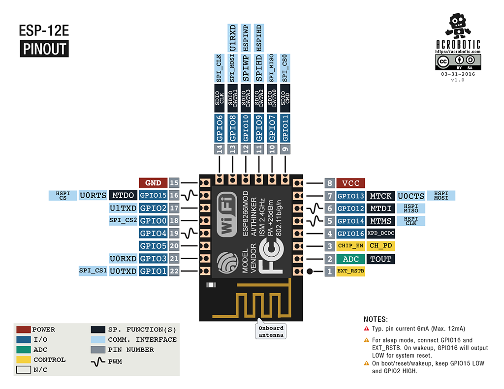

# ESP-12F Board

This KiCAD project template is the basis of a board integrating the ESP-12F Board from AI Thinker.

This template includes the basic schematic (and routing) needed to integrate this module in your own PCB design.

Look at this beautiful pinout sourced from: [Acrobotics web page](https://acrobotic.com/products/acr-00021)

(c)2019 Maximilian Deubel
